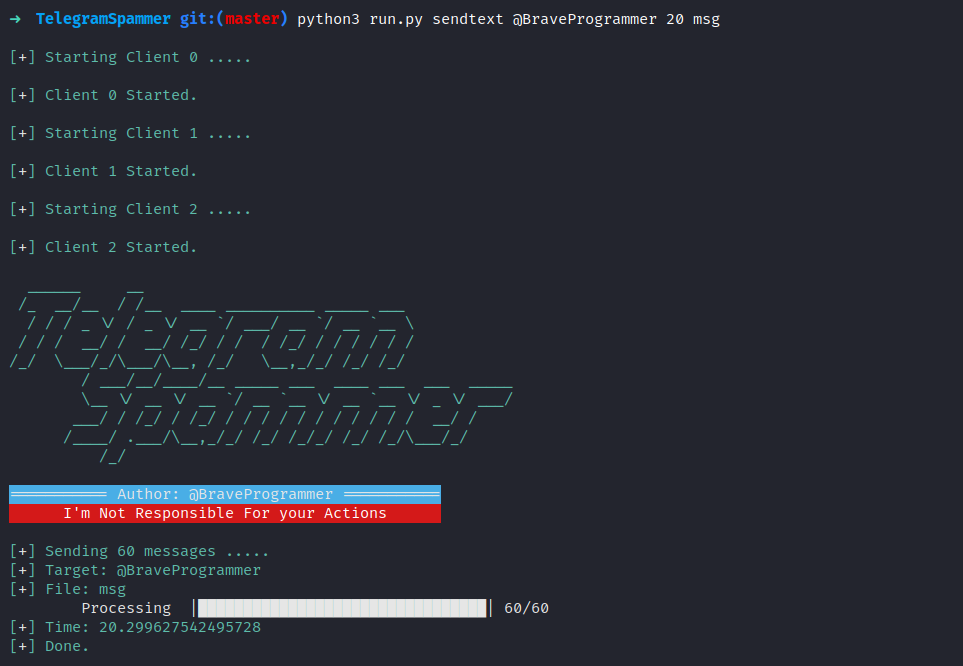

# تلگرام اسپمر

تلگرام اسپمر ابزاری است که شما را در اسپم کردن و کارهای دیگر در تلگرام کمک میکند.

# نصب
بعد از کلون کردن باید کتابخانه های پایتون را نصب کنید.

```bash
pip3 install -r requirements.txt
```

سپس باید دستور زیر را اجرا کنید کنید.

```bash
python3 setup.py build_ext --inplace
```

**نکته:** اگر با خطایی روبرو شدید نگران نباشید این کار برای این است که سرعت برنامه بالا برود. اگر با خطا مواجه شدید برنامه کار خواهد کرد اما با سرعت کمتر.

بعد از نصب کتابخانه ها ابتدا باید در سایت [My Telegram](https://my.telegram.org/auth) وارد شوید و احراز هویت کنید.
سپس وارد قسمت API Development شوید فیلد ها را پر کنید.

سپس فایل **config.ini** را ایجاد کنید و مقادیر را جایگزین کنید:

```ini
[auth]
api_id = Your API ID
api_hash = Your API Hash
client_count = Your Accounts Count

[client0]
phone = Your Phone Number
name = Name

.....
```

# بروزرسانی

برای بروزرسانی تلگرام اسپمر اسکریپت `update.sh` را اجرا کنید.

```bash
sh update.sh
```

# طرز استفاده

وارد برنامه شوید.

```bash
python3 main.py
```

برنامه دستورات مختلفی دارد.

*دستورات ساده:*

| دستور | توضیحات                          |
| ------- | ------------------------------ |
| exit    | خروج از برنامه                 |
| clear   | پاک کردن صفحه                  |
| history | نمایش دستورات استفاده شده      |
| banner  | نمایش بنر                      |
| help    | نمایش help برای دستور وارد شده |

**نکته**: میتوانید از تب برای کامل کردن دستورات استفاده کنید  
**نکته ۲**: برای کسب اطلاعات بیشتر درباره ی هر دستور از دستور زیر استفاده کنید:

```bash
help دستور
```
یا
```bash
دستور -h
```

## ارسال پیام متنی

ابتدا یک فایل از پیام هایی که میخواهید ارسال کنید درست کنید.

سپس در برنامه با استفاده از دستور زیر میتوانید پیام انبوه ارسال کنید.

```bash
sendtext -f file [-c count] target
```

> target: تارگت  
> -f file: فایلی که پیام ها را در ان نوشتید  
> -c count: تعداد تکرار (پیام های درون فایل هرکدام حداقل یک بار ارسال خواهند شد)  

## عضو/لفت دادن از گروه یا کانال

```bash
join ChatID ClientNumber [-p]
```

> ChatID: آیدی چتی که میخواهید در آن عضو شوید.  
> ClientNumber: شماره اکانتی که میخواهید با آن عضو شوید.  
> -p: اگر چت خصوصی است از این گزینه استفاده کنید (اختیاری)

```bash
leave ChatID ClientNumber
```

> ChatID: آیدی چتی که میخواهید از‌ آن لفت بدهید.  
> ClientNumber: شماره اکانتی که میخواهید با آن لفت بدهید.

## ریپورت

```bash
report ID Type [-c count]
```

> ID: یوزرنیمی که قصد ریپورت آن را دارید.  
> Type: انواع ریپورت عبارتند از: port, spam, copyright, childabuse, violence and geoirrelevant.  
> -c count: تعداد ریپورت.

# بلاک/آنبلاک

```bash
block ID Client_Number
```

> ID: آیدی کسی که میخواهید بلاک کنید.  
> ClientNumber: شماره اکانتی که میخواهید با آن بلاک کنید.

```bash
unblock ID Client_Number
```

> ID: آیدی کسی که میخواهید آنبلاک کنید.  
> ClientNumber: شماره اکانتی که میخواهید با آن آنبلاک کنید.  

# مشارکت
برای مشارکت در این پروژه از طرق pull requests اقدام کنید یا به [آیدی](https://t.me/BraveProgrammer) من در تلگرام پیام بدهید.

# حمایت مالی
Bitcoin: 1GKiThh6AaAj8Y1TEbwgC6cvrD82UyWDFk
