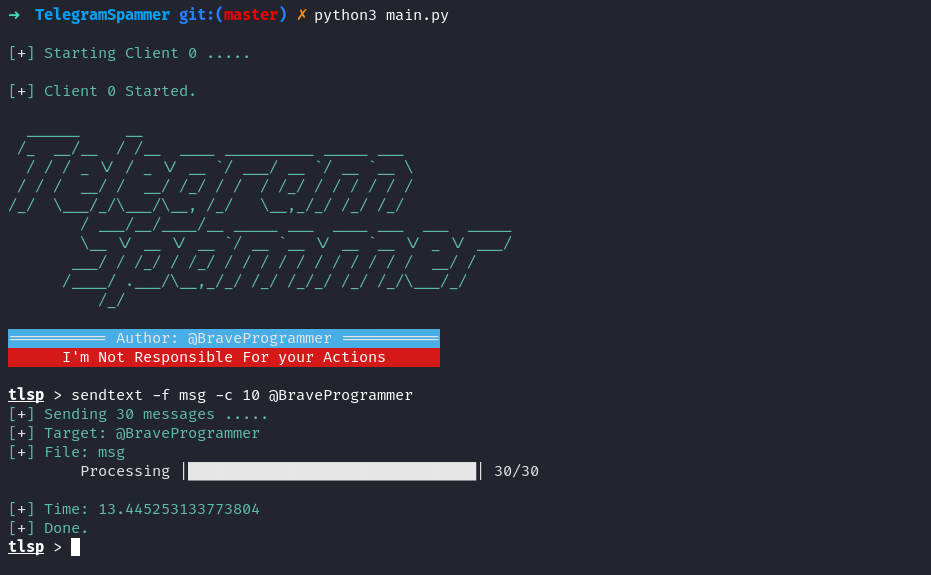

# Telegram Spammer

Telegram spammer is a tool helps you in spam and other thing in telegram.

# Install
After you cloned the repository install needed libraries.

```bash
pip3 install -r requirements.txt
```

Then run this command:

```bash
python3 setup.py build_ext --inplace
```

After installing libraries go to [My Telegram Website](https://my.telegram.org/auth) and login. then go to `API Development` and fill the fields and create your app.

Then run `python3 run.py conf` to open config file. then edit file:

```ini
[auth]
api_id = Your API ID
api_hash = Your API Hash
client_count = Your Accounts Count

[client0]
phone = Your Phone Number
name = Name

.....
```

# Update

To update Telegram Spammer run `update.sh` script.

```bash
bash update.sh
```

## Send text messages

First create a file and write messages you want to send.

Then use this command to send messages.

```bash
python3 run.py sendtext target count file
```

> target: Your Target  
> count: The number of messages you want to send.  
> file: File name that you created  

## Join/Leave chat or channel

```bash
python3 run.py sendtext ChatID ClientNumber private
```

> ChatID: That chat or channel you want to join  
> ClientNumber: That client you want to joins chat  
> private: If chat is private use this option. if its public use public.  

```bash
python3 run.py leave ChatID ClientNumber
```

> ChatID: That chat or channel you want to leave.  
> ClientNumber: That client you want to leaves chat.  

## Report

```bash
python3 run.py report target count type
```

> target: That username you want to report.  
> count: count of reports.  
> type: the report types are: port, spam, copyright, childabuse, violence and geoirrelevant.  

## Block/Unblock

```bash
python3 run.py block ID ClientNumber
```

> ID: That username you want to block.  
> ClientNumber: That client you want to blocks someone.  

```bash
python3 run.py unblock ID ClientNumber
```

> ID: That username you want to unblock.  
> ClientNumber: That client you want to unblocks someone.  

## Forward

```bash
python3 run.py forward from to count
```

> from: That chat you want to forward messages from that.  
> to: That chat you want to send messages.  
> count: count of messages.  

# Contribute

Apply to participate in this project through pull requests or send a message to my ID in Telegram.

# Donate

Bitcoin: 1MfNQeCcX7W9Uu6jy2HagCz4SH2LhwU3Ki

